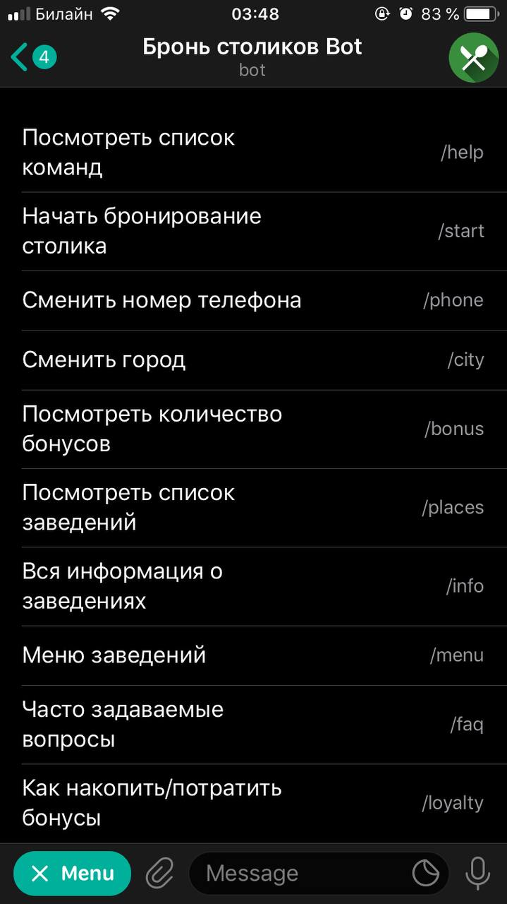
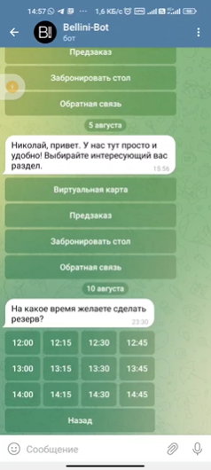
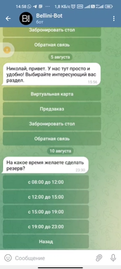
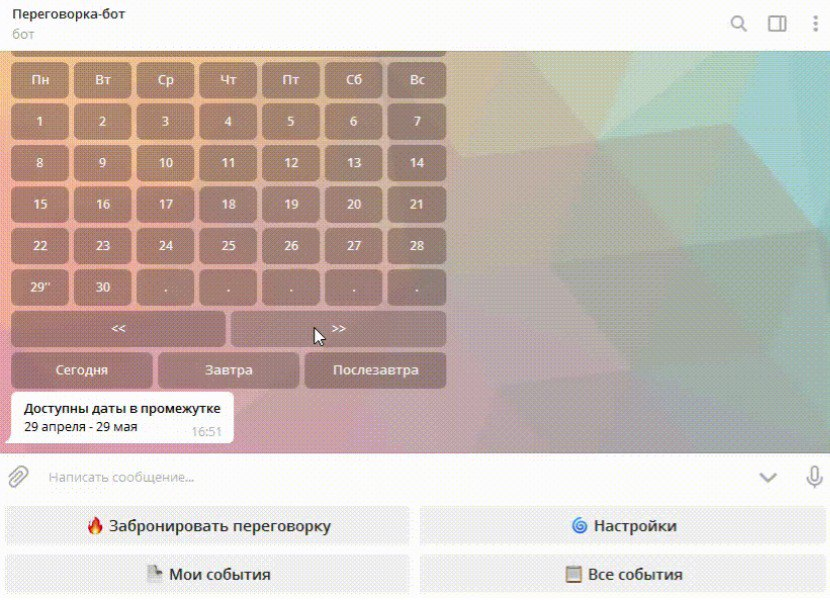
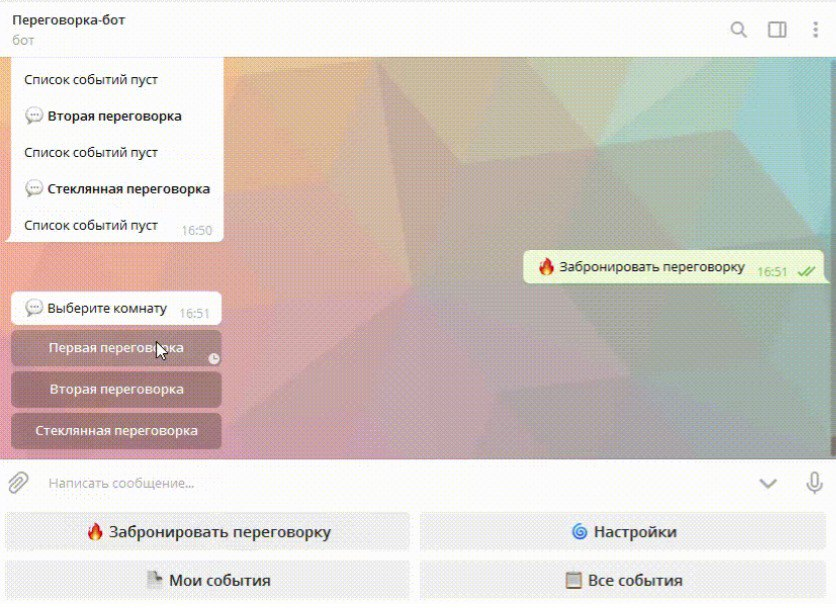

# 1.2. Анализ существующих решений
Критерии:
1) Понятность: действия, которые предлагает бот должны быть понятными пользователю;
2) Эргономика: у бота удобные меню и функционал для пользователя.
3) Загруженность экрана: меню содержит 3-5 пунктов, не более;
4) Информативность: в ответах бота содержится достаточное количество информации для пользователя;
5) Поддержка: возможность дать обратную связь по работе бота разработчику;
6) Удобство редактора: есть возможность добавить/изменить имеющуюся информацию или функционал;
7) Хороший дизайн: бот имеет ненавязчивый приятный дизайн и сбалансированную цветовую гамму;
8) Положительный пользовательский опыт: общение с ботом не вызывает негативных эмоций;
9) Возможность интеграции: к боту можно подключить другие сервисы; 
10) Особенности сервиса: имеется необычный функционал или интересные фичи;
11) Геолокация: бот может предлагать варианты для пользователя на основе текущей геолокации;
12) Дополнительные функции: давать информацию на частые вопросы и т.д.

Бот 1: Бронь столиков Bot (чат-бот для бронирования столиков в заведениях) \
Бот 2: Bellini-Bot (бронирование столов в ресторане сети Bellini) \
Бот 3: Переговорка-бот (бронирование переговорок в компании Intaro) 

| Критерий                            | Бот 1                         | Бот 2                       | Бот 3                   |
|-------------------------------------|-------------------------------|-----------------------------|-------------------------|
| Понятность                          | -                             | +                           | +                       | 
| Эргономика                          | -                             | +                           | +                       |
| Загруженность экрана                | Слишком много пунктов         | + оптимально                | +                       | 
| Информативность                     | +-                            | +                           | +                       | 
| Поддержка                           | -                             | +                           | +                       |  
| Удобство редактора                  | Нет возможности оценить       | Нет возможности оценить     | Нет возможности оценить | 
| Хороший дизайн                      | -                             | +                           | +                       |  
| Положительный пользовательский опыт | - Не все пункты меню работают | +                           | +                       | 
| Возможность интеграции              | +                             | +                           | +                       |  
| Особенности сервиса                 | + Данные по всей стране       | Хорошая детализация времени | Отображается весь месяц | 
| Геолокация                          | +                             | -                           | -                       |  
| Дополнительные функции              | -                             | -                           | Отображаются события    | 

Бронь столиков Bot \

Bellini-Bot \

Переговорка-бот 
